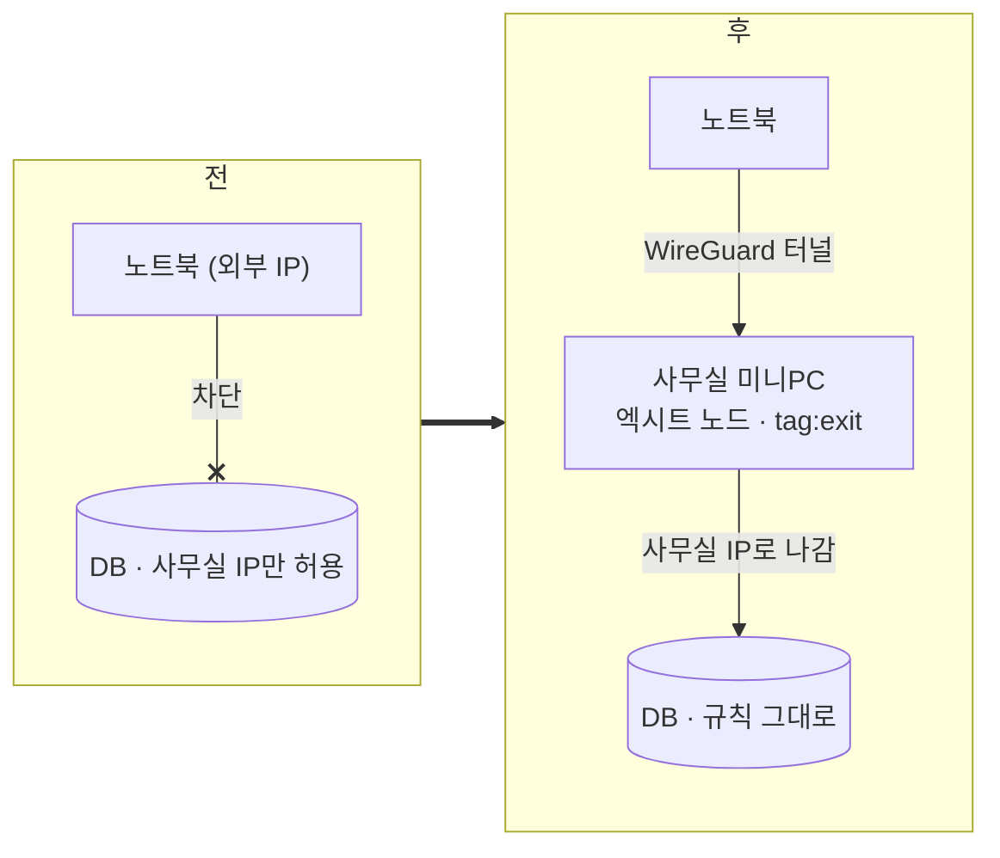

# 2026-10-02

**요약**: 사무실 IP로만 열려 있던 DB에 밖에서도 붙을 수 있게 Tailscale 엑시트 노드를 사무실 미니PC에 세웠다. 비용 0, DB 쪽 inbound 규칙 변경 0. LTE에서 엑시트를 켜면 사무실 IP로 나가 DB 포트가 열리는 것까지 실측했고, 팀원 한 명 온보딩에서 "로그인은 됐는데 엑시트 노드가 안 보이는" 함정을 하나 겪었다.

## 배경과 제약
DB(클라우드 RDS, 사무실 MySQL) 둘 다 inbound가 사무실 고정 IP 하나로 제한돼 있다. 집이나 카페에서는 못 붙는다. 요구는 "어디서든 켜면 같은 IP로 나가게"였고, 팀원도 각자 노트북에 깔아 쓸 예정이라 계정 단위로 누가 들어오는지 통제돼야 했다. 예전엔 가상머신을 점프 호스트로 SSH 터널을 팠는데 그 머신은 이제 안 쓴다.

## 선택
출구 서버를 어디 둘지가 유일한 결정이었다.

| 선택지 | 비용 | 장점 | 단점 |
|---|---|---|---|
| 클라우드 초소형 VM + 고정 IP | 월 3~4달러 | 사무실 회선·전원과 무관 | 보안그룹·공유기에 새 IP 추가 필요 |
| 사무실 미니PC (선택) | 0 | 사무실 IP가 이미 허용돼 있어 규칙 추가 없음, 러너·로그 수집으로 상시 기동 중 | 사무실 인터넷 끊기면 전원 차단 |
| Tailscale 없이 WireGuard 직접 | 0 | 사용자 수 제한 없음 | 키를 내가 만들어 나눠줘야 하고 SSO 없음 |

"돈 안 드는 쪽"이 기준이라 미니PC. Tailscale 무료 플랜은 사용자 3명까지라 지금 팀 규모엔 맞고, 넘으면 그때 WireGuard로 갈아탈 수 있게 미니PC 쪽 설정은 최소로 뒀다.

ACL도 최소로 잡았다. 처음 초안엔 "미니PC SSH는 관리자만" 같은 줄을 넣었는데, 목적이 DB 접근이지 미니PC 접근이 아니라는 지적을 받고 뺐다. 남은 건 셋: 출구 태그를 붙일 수 있는 건 관리자뿐, 그 태그가 붙은 기기는 엑시트 노드 자동 승인, 멤버 전원은 인터넷으로 나가는 것만 허용. 멤버끼리 서로의 기기는 안 보인다. "누가 들어오는가"는 ACL이 아니라 회사 구글 워크스페이스 도메인으로 로그인하는 테일넷 자체가 가른다.

## 막혔던 것
- **태그 거부.** 미니PC에서 `tailscale up --advertise-exit-node --advertise-tags=tag:exit`를 먼저 돌리고 로그인 URL을 열었더니 "requested tags are invalid or not permitted". ACL에 태그 소유자를 아직 저장하지 않은 상태였다. 순서는 ACL 저장 → 기기 로그인. 반대로 하면 로그인 자체가 거부된다.
- **핫스팟 테스트가 무의미했다 — 틀렸던 가설.** 폰 핫스팟으로 붙여 Tailscale을 끈 채 DB가 열리길래 "IP 제한이 없나?"로 갔다. 아니었다. 폰이 사무실 Wi-Fi에 붙은 채 핫스팟을 켜서 사무실 인터넷을 그대로 중계하고 있었고, 공인 IP를 찍어보니 사무실 IP였다. 폰 Wi-Fi를 끄고 LTE로만 가니 그제야 타임아웃이 났다. "다른 네트워크에서 테스트한다"는 전제부터 `curl ifconfig.me`로 확인해야 했다.
- **켠 것과 고른 것은 다르다.** LTE에서 Tailscale을 켰는데도 안 됐다. 앱이 켜진 건 테일넷에 연결된 것일 뿐이고 트래픽은 그대로 LTE로 나간다. Exit Node를 미니PC로 **골라야** 사무실 IP가 된다. 상태 출력에 `exit node;`가 붙어야 켜진 것.
- **팀원 로그인은 됐는데 엑시트 노드가 비어 있었다.** 팀원 회사 메일이 구글 계정이 아니라 지메일로 외부 초대를 받았는데, 지메일로 앱 로그인을 하면 Tailscale이 그 사람 개인 테일넷을 새로 만들어 거기로 들어간다. 관리 화면 Users엔 멤버로 떠 있는데 Machines엔 기기가 없는 게 단서였다. 앱의 계정 메뉴에서 회사 테일넷으로 전환하니 바로 보였다. 한 번 고르면 앱이 기억한다.

## 결과와 대가
LTE에서 실측. 엑시트 끄면 RDS 포트와 사무실 MySQL 포트 둘 다 타임아웃, 켜면 공인 IP가 사무실 IP로 바뀌고 둘 다 연결. 사무실 안에서는 켜나 끄나 같은 IP라 사무실에서는 검증이 안 된다. 미니PC 설치부터 팀원 1명 합류까지 2시간쯤.

대가: 엑시트를 켜 둔 동안 브라우저 포함 모든 트래픽이 사무실 회선으로 나간다. DB 볼 때만 켜고 끄는 습관이 필요하다. 사무실 인터넷이 죽으면 팀 전원이 못 쓴다. 무료 플랜 3명 정원이라 한 명 더 넣으면 끝.

## 남은 것
- 세 번째 사람부터는 유료냐 WireGuard냐를 정해야 한다.
- 테일넷 소유자가 내 개인 회사 계정이다. 계정이 없어지면 관리 권한도 같이 간다. 공용 관리 계정으로 옮길지.
- 인프라 README가 아직 옛 점프 호스트 기준이라 이 경로로 갱신해야 한다.
- 지메일 팀원은 다음에도 같은 함정을 밟을 테니 온보딩 안내문에 "회사 테일넷 선택" 한 줄을 넣었다.

태그: #tailscale #exit-node #wireguard #vpn #network-access #onboarding #acl
